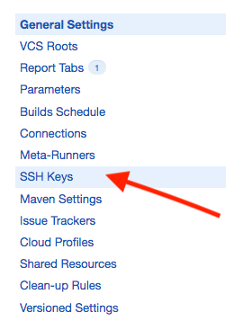

Hi! Today topic will be about [TeamCity](https://www.jetbrains.com/teamcity/) and how to provide continous integration in your iOS project.

## Motivation

I configured a TeamCity many times and for many projects. There are many adventages of using Continous Integration system in your project development process. Also, there is a lot of alternatives to TeamCity like [CircleCI](https://circleci.com/), [TravisCI](https://travis-ci.org/) and many more. But in this post I want to share with you with experience that I gained in Bright Inventions.

Every project that we starts - we starts from configuring Continous Integration stuff and in our case we use a TeamCity to handle that.

This post will be more like a tutorial that will guide you through all basic and most important steps due to configure iOS project. Also, I assume that you already download, and host you teamcity service.

Hope you will like it!


## Step 1: Create a root project

Firstly, you need to go to page where your TeamCity is hosted. After log-in, go to the Administration Page, click `Projects` tab in `Project-related Settings` section and click `Create project`


 
after that you should see configuration screen for Version Control that is used in your project.


I prefer a way that, I will configure everything manually, but of course you can go with predefined sections like : `From GitHub`. `From Bitbucket Cloud` etc.
All you need to do in this step is to provide a Name of your project and then tap `Create`

## Step 2: Add VCS root

Of course, in order to build our project we need to provide a sources to build.
Our TeamCity service should be able to fetch changes from repository. If you using a GitHub or BitBucket or platforms similar to these you have two ways:

* Give a credentials to account which have access to the repository

or

* Generate a SSH key and use it to authorize TeamCity in GitHub/Bitbucket

I this post I will show you how to configure it with upload SSH key.

### Generate new SSH key

*If you haven't heard about generating SSH keys, or you don't know what SSH keys really are. Check [this link](https://help.github.com/articles/generating-a-new-ssh-key-and-adding-it-to-the-ssh-agent/)*

To generate new SSH keys you can use terminal command:

```
ssh-keygen -t rsa
```

provide a name for new key, and optional passphrase, then in directory in which you ran `ssh-keygen -t rsa` command you should see two keys. One public with `.pub` extension, and second - private.
The public one will be used in your repository on github/bitbucket. The private key will be used in TeamCity service. 

### Use generated key in TeamCity

Go to already created project, settings page and click `VCS SSH Keys` tab.




Click on `Upload SSH Key`. After that you should see a pop-up window which allows you to upload the previously created SSH Key.
*Please keep in mind to upload a private part of your key, without `pub` extension*. If you choose correctly, click save and you should see screen like this:


As you can see in `Usage` tab, the key is not used in the configuration yet.
In order to use it - you have to go through the next steps...


### Configure VCS root

Go to already created project, settings page and click `VCS Roots` tab.

 // CHANGE IMAGE. SHOW SSH Keys(1) and say something about it

//


## Step 3: Create build configuration
create manually, attach root
## Step 4: Configure build steps for configuration
add 2 steps, install dependencies, run fastalne, 
## Step 5: Triggers
VCS trigger, scheduled trigger and say something more about it
## Step 6: Failuire Conditions
60 minutes failuire conditions, and some more
## Step 7: Build Features
XML Report - unit tests, Rvm 
## Step 8: Parameters
fastlane password, match password, xcodepath, build number
## Step 9: Agent machine
How to configure agent?
Link to Team City docs,
Go to Agents -> Install via ZIP
Authorize agent
## Step 10: Setup Agent requirements for build configuration
select by jvm.os.name = MAC Os
## Step 11: Ready for build - RUN!
show screen with progress, build log, with all steps
## Step 12: Artifacts!
screen, path, text abut it


